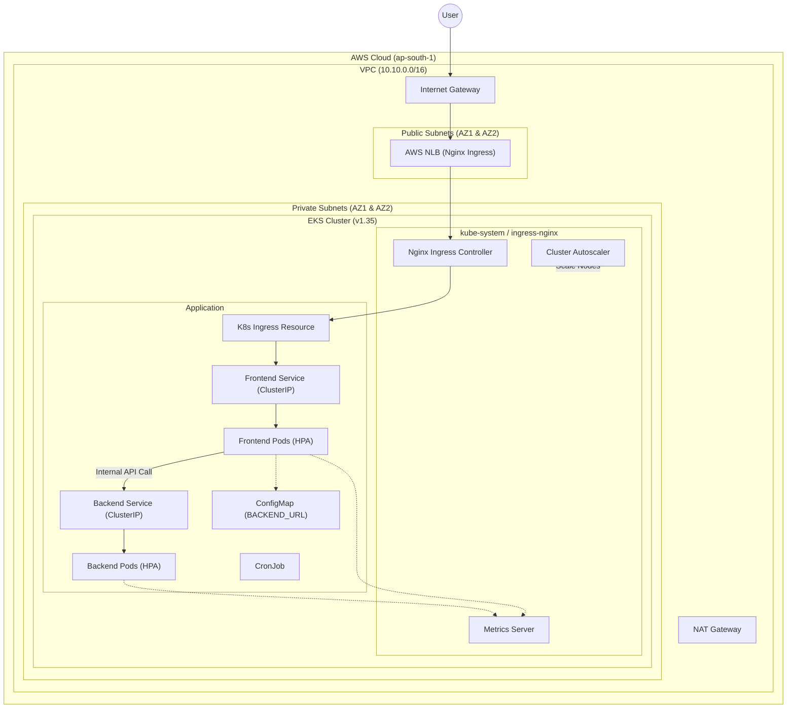

# Infrastructure Architecture Diagram

This diagram represents the AWS infrastructure and Kubernetes deployment for the Node.js application.

## How to View This Diagram

1. **GitHub/GitLab:** If you push this file to a GitHub or GitLab repository, it will automatically render the diagram.
2. **VS Code:** Install the **"Mermaid Previewer"** or **"Markdown Preview Mermaid Support"** extension. Then, open this file and press `Ctrl+Shift+V` to see the live preview.
3. **Mermaid Live Editor:** 
   - Copy the code block above (from `graph TD` to the end of the block).
   - Go to [Mermaid.live](https://mermaid.live/).
   - Paste the code into the editor on the left.
4. **Notion/Obsidian:** These tools support Mermaid diagrams natively. Simply paste the code block into a page.
